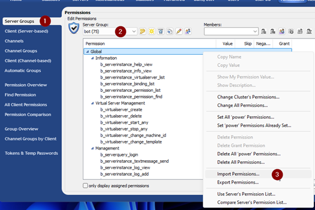
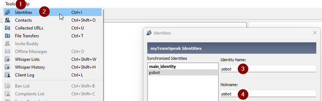

Testing with Live or Development Server
==================
## Setup Environment

```shell
cp .env.testing.example .env.testing
```
Replace all `DEV_LIVE_SERVER_*` Variables with your Teamspeak Configuration

| Environment Variable                   | Description                                                                                                          |
|----------------------------------------|----------------------------------------------------------------------------------------------------------------------|
| DEV_LIVE_SERVER_AVAILABLE=             | Activate Channel Tests (Default =  false). At false all Channel Tests will be skipped                                |
| DEV_LIVE_SERVER_HOST=                  | Your Host Address (Recommended: IPv4)                                                                                |
| DEV_LIVE_SERVER_QUERY_PORT=            | Raw = 10011 / ssh = 10022 (Recommended: Raw Mode)                                                                    |
| DEV_LIVE_SERVER_QUERY_USER=            | Your Query Username                                                                                                  |
| DEV_LIVE_SERVER_QUERY_USER_PASSWORD=   | Password for the Query User                                                                                          |
| DEV_LIVE_SERVER_UNIT_TEST_CHANNEL=     | Setup a Channelname for Channel Tests. The Live Server Tests will create channels under this configured Channelname* |
| DEV_LIVE_SERVER_UNIT_TEST_USER_ACTIVE= | Activate User Tests (Default = false). At false all User Tests will be skipped                                       |
| DEV_LIVE_SERVER_UNIT_TEST_USER=        | Setup a Teamspeak Testclient. It will be use for Client Tests                                                        |
| DEV_LIVE_SERVER_UNIT_TEST_SIGNALS=     | Test Signals. Default = false. NOTE: This Test has a very long Test duration.                                        |

### Important Configuration
*Set Permission Change (Modify) Power and Delete Power to 75. Otherwise, the tests with channel permissions will be fail.

### Important Notes
If you run this Live Server Tests the Clients see massive Server Log entrys with Anti-Flood errors.<br>
The test are very quickly with a lot of connections from the bot (one connection and disconnection for each test).<br>
The Serveradministrator has no Anti-Flood Permissions, so maybe you as Administrator cant see this entrys.

---

## Setup your Bot Identity
### Setup Query / Bot Servergroup
Create a new server group with the name psbot, bot or a name of your choice.<br>
You find a set of rights (150) at [doc/query_user_servergroup_export](query_user_servergroup_export.csv) that the bot needs for secure operation.<br>
The easiest way to set these settings is with [YaTQA](https://yat.qa/) as serveradmin.

#### Import CSV with YaTQA
Navigate with YaTQA to Servergroups **(1)**. Choose your created Servergroup for the query bot **(2)**. Right Click on Global and Click at Import Permissions **(3)**.
Select and Import the CSV.<br>


---

#### Create a new Bot Identity
Start the Teamspeak client and create a new identity. You can create this via Extras **(1)** - Identities **(2)**. To do this, click on Create and enter a name as the identity name **(3)** and nickname **(4)**. Then confirm with OK. Now connect to your server **with this identity**. You can tell whether the identity is being used by the bold font.<br>


Now assign the bot server group to the bot identity. The bot identity is now in the bot server group. Connect with the bot identity to your Server and create a new Query Login. The name you have to enter is your query login name. The password is generated automatically.<br>
**IMPORTANT: SAVE THE LOGIN NAME AND PASSWORD**<br><br>
Leave the server and change your identity back to the one you used previously. The bot identity is no longer needed. Your server now knows this identity.<br>
**NOTE:** If you lost your Identity? No Problem! Create a new one by repeat the previously steps. Delete the older Identity form your Server (by using YaTQA at User DB entrys) 

